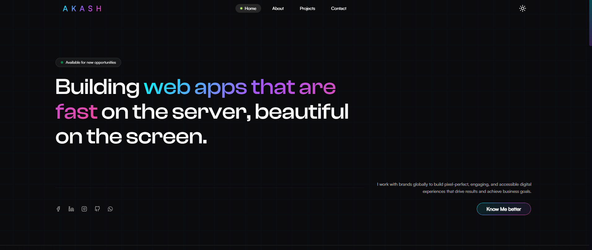
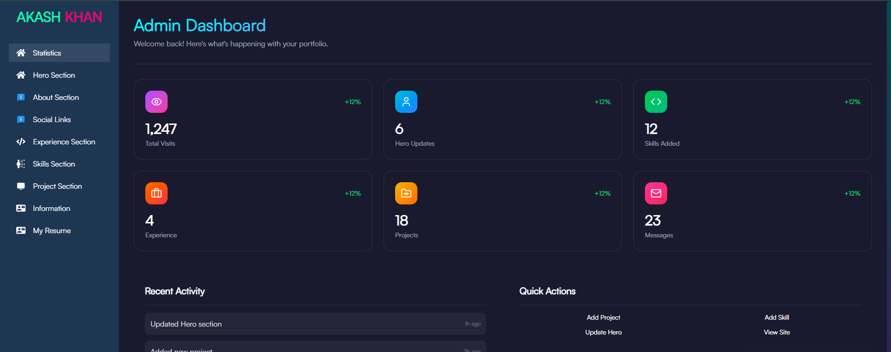

# 🚀 Personal Portfolio & Admin Dashboard

A modern full-stack developer portfolio built with Next.js, TypeScript, Tailwind CSS, MongoDB, and custom JWT authentication.

This platform includes:

- Dynamic portfolio website
- Secure admin dashboard
- Project management system
- Resume management system
- Authentication & authorization
- Token refresh system
- Cloud/Vercel Blob file upload
- Fully responsive UI

---

# ✨ Features

## 🌐 Portfolio Website

- Responsive modern UI
- Smooth scrolling navigation
- Dynamic project showcase
- Resume download/view system
- Contact section
- Dark mode support

---

## 🔐 Admin Dashboard

- Secure admin authentication
- JWT access token & refresh token
- Protected admin routes
- Auto token refresh system
- Logout functionality

---

## 📁 Project Management

- Create projects
- Edit projects
- Delete projects
- Technology tags system
- Image upload support
- Dynamic project rendering

---

## 📄 Resume Management

- Upload resumes
- Publish/unpublish resume
- Resume preview
- Resume viewer system
- Multiple resume support
- Vercel Blob file upload

---

# 🛠 Tech Stack

## Frontend

- Next.js 16.2.3
- React
- TypeScript
- Tailwind CSS
- React Hook Form
- SWR
- Framer Motion

---

## Backend

- Next.js API Routes
- MongoDB
- Mongoose
- JWT Authentication
- bcryptjs

---

## Storage & Upload

- Vercel Blob
- Cloudinary

---

# 🔐 Authentication System

This project uses a custom authentication system with:

- Access Token
- Refresh Token
- HttpOnly Cookies
- Protected Routes
- Automatic Token Refresh

---

# 📂 Folder Structure

```bash
src/
│
├── app/
│   ├── api/
│   ├── admin/
│   ├── login/
│   └── ...
│
├── components/
│
├── hooks/
│
├── interface/
│
├── lib/
│
├── model/
│
├── helpers/
│
└── middleware.ts
```

---

# ⚙️ Environment Variables

Create a `.env.local` file:

```env
NODE_ENV=
NEXT_PUBLIC_API_URL=
MONGODB_URI=
JWT_SECRET=
NEXT_PUBLIC_CLOUDINARY_CLOUD_NAME=
NEXT_PUBLIC_CLOUDINARY_API_KEY=
NEXT_PUBLIC_CLOUDINARY_API_SECRET=
NEXT_PUBLIC_CLOUDINARY_UPLOAD_PRESET=
NEXT_PUBLIC_ADMIN_EMAIL=
NEXT_PUBLIC_ADMIN_PASSWORD=
BLOB_READ_WRITE_TOKEN=
ACCESS_TOKEN_SECRET=
REFRESH_TOKEN_SECRET=
```

---

# 🚀 Installation

## 1️⃣ Clone Repository

```bash
git clone https://github.com/akash-khan-311/new-portfolio/tree/main
```

---

## 2️⃣ Install Dependencies

```bash
npm install
```

---

## 3️⃣ Run Development Server

```bash
npm run dev
```

---

# 🔑 Admin Access

Admin account is automatically seeded into the database using the seed admin system.

Use your configured admin credentials to login.

---

# 📸 Screenshots

## Portfolio Home



---

## Admin Dashboard



---

# 🌍 Deployment

This project can be deployed on:

- Vercel
  

Recommended: **Vercel**

---

# 📌 Future Improvements

- Blog system
- Analytics dashboard
- Multi-admin support
- Role-based permissions
- Email notifications
- AI integrations

---

# 👨‍💻 Author

## Akash Ali

Junior MERN Stack Developer

---

# 📄 License

This project is licensed under the MIT License.